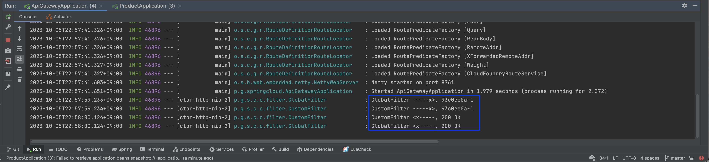

# API Gateway Filter

The apigateway filter can be managed as a Spring Bean.

<br/><br/><br/><br/>

## Getting Started

You must set up application.yml, application-test.yml for each module before running the program.

> You should install jdk 17 or higher. <br/>

<br/><br/><br/>

## Run Application

````text
$ ./gradlew ${MODULE}:bootRun
````

<br/><br/><br/>

## Run Build

````text
$ ./gradlew ${MODULE}:build
````

<br/><br/><br/>

## Result

The Global Filter works first.



<br/><br/><br/>

## Env

&nbsp;&nbsp; - Java 17 <br/>
&nbsp;&nbsp; - SpringBoot 3.0 <br/>

