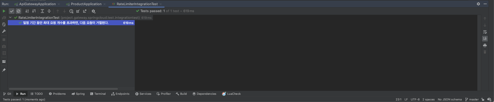

# RateLimiter

RateLimiter implemented using Spring Cloud. Redis and Luascript allow multiple commands to be sent in one piece,
allowing operations to be handled atomically.

<br/><br/><br/><br/>

## Getting Started

You must set up application.yml, application-test.yml for each module before running the program.

> You should install jdk 17 or higher. <br/>

<br/><br/><br/>

## Run Application

````text
$ ./gradlew ${MODULE}:bootRun
````

<br/><br/><br/>

## Run Test

````text
$ ./gradlew ${MODULE}:test
````

<br/><br/><br/>

## Run Build

````text
$ ./gradlew ${MODULE}:build
````

<br/><br/><br/>

## Result

With TimeBased Sliding-Window, `even if redis operates as a single thread, the request times can be the same if multiple
requests are made at the same time.` Therefore, you have to give a delay even if it's 1ms.

```java

@SpringBootTest
@ActiveProfiles("test")
@DisplayName("[IntegrationTest] RateLimiter 통합 테스트")
class RequestRateLimiterGatewayFilterFactoryTest {

    @Autowired
    private RateLimiter rateLimiter;

    @Autowired
    private ReactiveRedisTemplate<String, String> redisTemplate;

    @BeforeEach
    void setUp() {
        redisTemplate.delete("192.168.0.1").block();
    }

    @Test
    @DisplayName("일정 기간 동안 최대 요청 개수를 초과하면, 다음 요청이 거절된다.")
    void rate_limit_test() {
        RateLimiter.Config config = new RateLimiter.Config();
        Flux<Boolean> resultsFlux = Flux.range(0, 5)
                .delayElements(Duration.ofMillis(1))
                .flatMap(i -> rateLimiter.isAllowed("192.168.0.1", config), 1);

        StepVerifier.create(resultsFlux)
                .expectNext(true, true, true, true)
                .expectNext(false)
                .verifyComplete();
    }
}
```



<br/><br/><br/>

## Env

&nbsp;&nbsp; - Java 17 <br/>
&nbsp;&nbsp; - SpringBoot 3.0 <br/>

